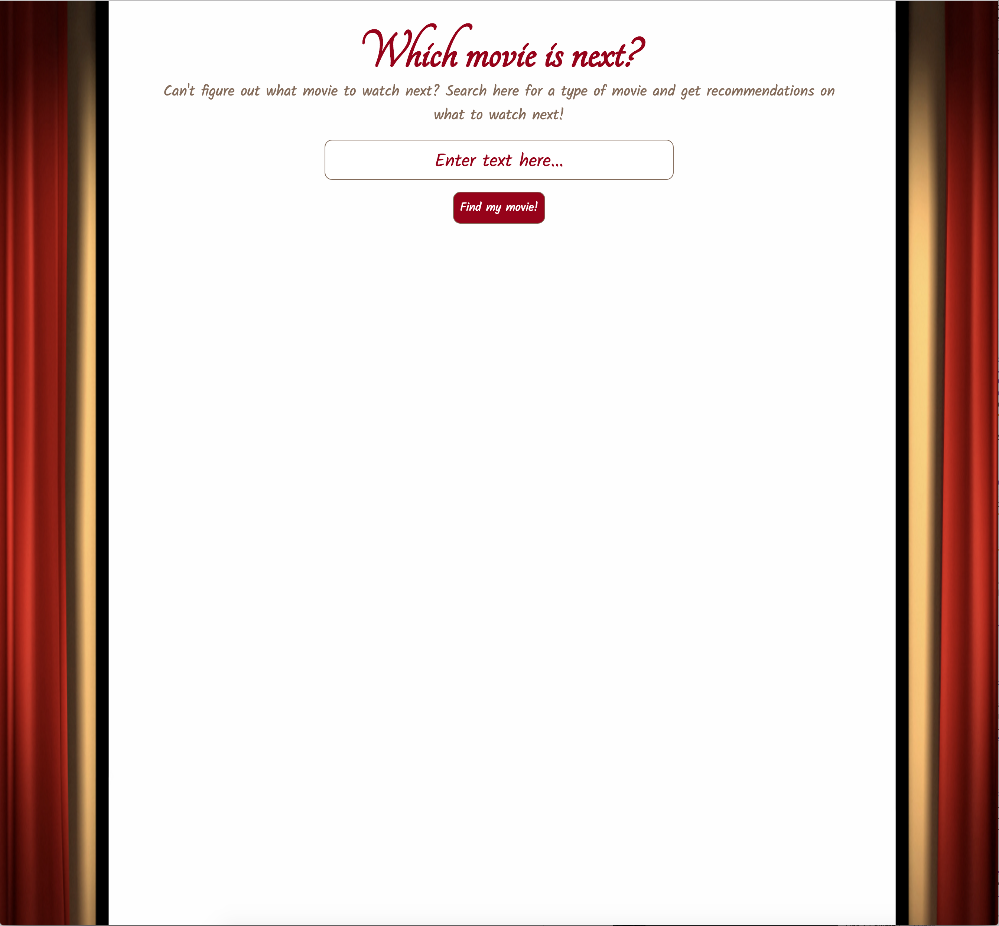
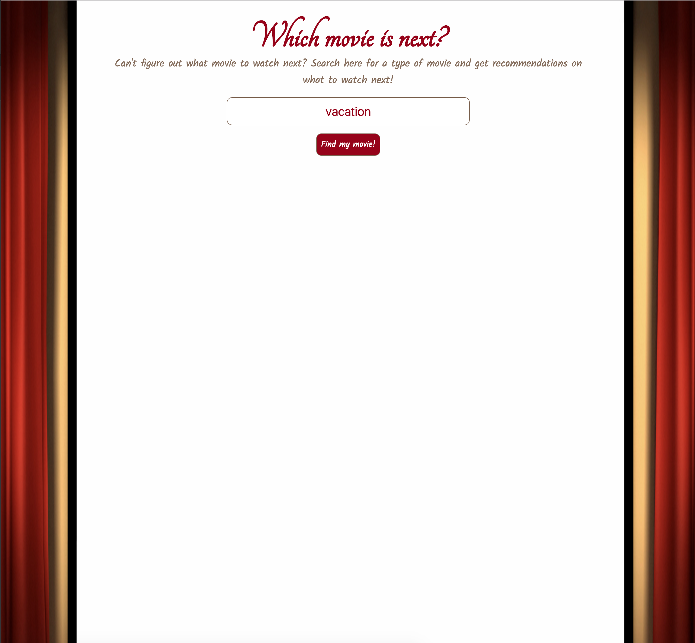
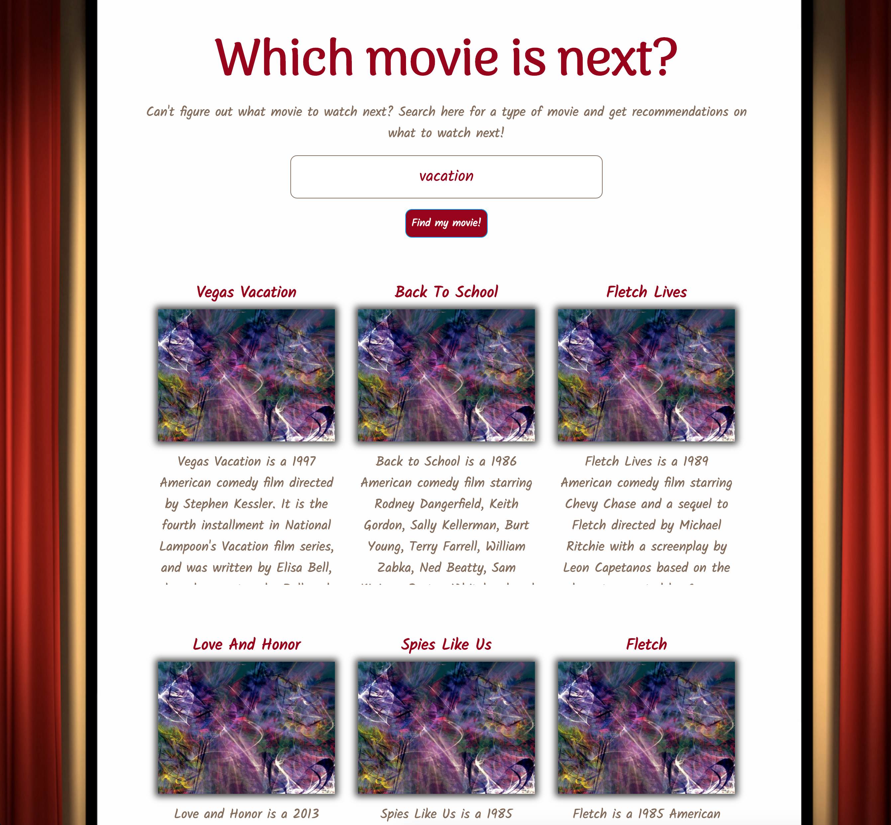

# Movie Search
Movie Search for Thinkful API Capstone Project - a place to search for movies types and get a list of movies recommended based on the users search. This app is useful for movie watchers who are trying to figure out what their next movie will be. After watching a movie, users can find themselves in a situation thinking "Which movie do I watch next?". This app is designed to help users answer that question. Movie search will allow users to search for a type of movie and it will return movie titles, descriptions, and a link with a clip from the movie results that are returned for the user.

Live site for Movie Search http://websitehere.com

## Techincal:
* Built with: HTML5, CSS3, JavaScript, jQuery
* TasteDive API used to provide movie search results
* App is responsive on mobile devices and desktop viewports

## Screenshots

