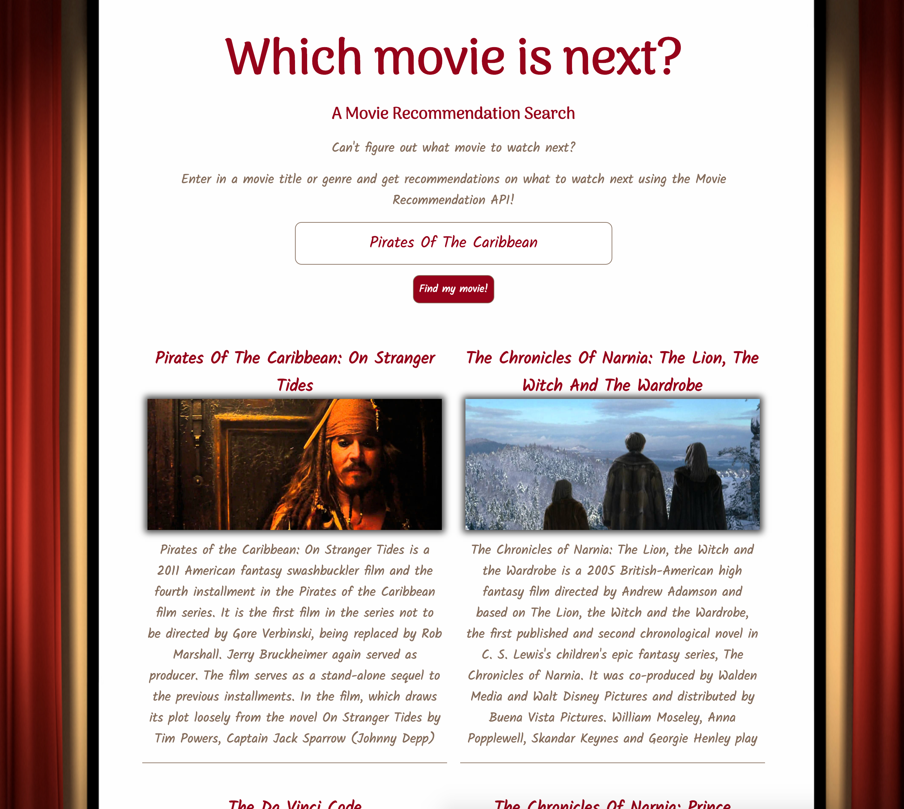

# Movie Recommendation Search
Movie Search for Thinkful API Capstone Project - a place to search for movie types and get a list of recommended movies based on the user search. This app is useful for movie watchers who are trying to figure out what their next movie will be based on a search term (movie or genre) provided. After watching a movie, users can find themselves in a situation thinking "Which movie do I watch next?". This app is designed to help users answer that question. Movie search will allow users to search by a movie title or genre and it will return recommended movies with titles, descriptions, and a link with a clip from the movie results for the user.

Live site for Movie Search https://kendallyn.github.io/api-capstone-movie-search

## Techincal:
* Built with: HTML5, CSS3, JavaScript, jQuery
* TasteDive API used to provide movie search results
* App is responsive on mobile devices and desktop viewports

## Screenshots

